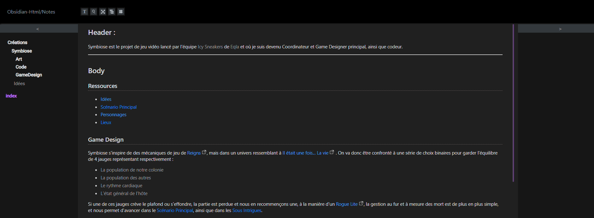

   
# Header :   
   
Je vais dans ce fichier faire un résumé des étapes importantes pour déployer un [Vault](/not_created.md) ou une partie d'un [Vault](/not_created.md) sur internet à l'aide du programme **ObsidianHTML**.   
*Toute la documentation pour l'utiliser de A à Z peut être trouvée sur la documentation officielle de [ObsidianHTML](https://obsidian-html.github.io/instructions/quickstart.html)*   
   
   
-------------------------------------------------------------------------------   
# Body   
   
## Mettre à jour le site   
   
*Cette section permet simplement de rappeler rapidement comment mettre à jour votre site une fois que votre Vault a été mis en ligne, si la procédure n'as pas encore été suivie entièrement une première fois, ne prenez pas attention à ceci.*   
   
   
- Ouvrir la [Console Windows](/not_created.md) où se situe le fichier `config.yaml` *(dans le dossier du repo)*   
- taper :  `obsidianhtml convert -i config.yaml`   
- Push le repo    
   
## Installation   
   
Pour installer **ObsidianHTML** il faut d'abord avoir la dernière version de [python](https://obsidian-html.github.io/instructions/quickstart.html).    
   
- Si vous ne l'avez pas, téléchargez et installez python. Lors de l'installation, cochez bien cette case :    
   
   
   
   
- Redémarrez ensuite votre ordinateur.   
- Ouvrez la [Console Windows](/not_created.md)   
- Regardez si Python est bien installé avec la commande : ``python --version`` (si il dit *commande non reconnue* c'est qu'il y a un soucis)   
- Il faut ensuite mettre à jour [pip](https://pypi.org/project/pip/) : ``pip install --upgrade pip``   
- Installer [pythonnet](https://github.com/pythonnet/pythonnet) :``pip install --pre pythonnet``   
- et enfin [obsidianhtml](https://github.com/obsidian-html/obsidian-html) : ``pip install obsidianhtml``   
   
## Vérification   
   
Tout est maintenant installé, reste plus qu'à voir si tout ça marche, pour ce faire :   
   
   
- placez vous dans le dossier d'une note que vous voulez voir en ligne   
- lancez l'invite de commande dans ce dossier   
- tapez : ``obsidianhtml run -f NomDeMonFichier.md``   
- Ouvrez un navigateur internet et tapez [http://localhost:8888](http://localhost:8888/)   
   
Si tout est ok, vous devriez voir votre fichier bien comme il faut et les liens qui permettent de voyager de fichier en fichier, un peu comme ceci :   
   
   
   
## Déploiement   
   
Le déploiement est assez rapide, je ne parlerai ici que de la méthode pour mettre le [Vault](/not_created.md) ou une partie de celui-ci sur votre [site GitHub](/not_created.md) accessible gratuitement à l'aide de [GitHub Pages](https://pages.github.com/). Il vous faudra donc votre [Repository](/not_created.md) prêt à être utilisé.   
   
   
- Dans l'explorateur de fichier, mettez vous à l'endroit où vous voulez créer votre page d'accueil de votre [Vault](/not_created.md), dans votre [repository](/not_created.md) qui va être en ligne.   
- Créez un fichier `config.yaml`   
- lancez votre [Console Windows](/not_created.md)   
- Dans votre fichier `config.yaml` collez le code suivant en modifiant les données entre guillemets avec les données qui correspondent à votre projet :   
   
```python
# Le dossier qui contient tout votre Vault
# Utilisez le chemin complet ou un chemin relatif mais pas ~/
obsidian_folder_path_str: '/chemin/a/votre/vault' 

# La note qui va être utilisée comme index.html
# doit se trouver dans votre obsidian_folder_path_str (la ligne du dessus)
# Utilisez le chemin complet ou un chemin relatif mais pas ~/
obsidian_entrypoint_path_str: '/chemin/a/votre/pagedaccueil.md'
```
   
   
Si votre dossier n'est pas la racine de votre projet, collez aussi ces lignes en changeant le sous dossier où l'on va trouver le site :   
   
```python 
# utilisez '/html_prefix' (avec un slash au début, mais pas à la fin)
html_url_prefix: '/prefix' 
```
   
   
A la fin, votre fichier doit ressembler à ceci :   
   
```python
obsidian_folder_path_str: 'C:\Users\philip.dupont\Desktop\Philip Dupont'

obsidian_entrypoint_path_str: 'C:\Users\philip.dupont\Desktop\Philip Dupont\Créations\Symbiose\Symbiose.md'

html_url_prefix: '/Symbiose/output/html'
```
   
   
   
- Une fois le fichier fini, sauvegardez-le et dans l'invite de commande préalablement lancée tapez : `obsidianhtml convert -i config.yaml`   
- Il ne reste plus qu'à push le repo.    
- Pour vos futures mise à jour il suffira de répéter les deux étapes précédentes.   
   
   
---------------------------------------------------------------------------   
# Footer   
   
##### Tags   
`{_obsidian_pattern_tag_guide}` `{_obsidian_pattern_tag_programme}` `{_obsidian_pattern_tag_html}` `{_obsidian_pattern_tag_documentation}` `{_obsidian_pattern_tag_obsidian}` `{_obsidian_pattern_tag_obsidianHTML}`   
   
*créé le 2023-08-03 à 10:55*