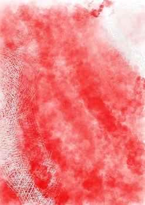

   
# Header :   
   
   
-------------------------------------------------------------------------------   
# Body   
   
## Ambiance   
   
Lieu rapide et électrique, ambiance de travail où les choses vont vite, des feuilles volent dans tous les sens, les couloirs sont interminable et dur à reconnaître. Un mélange entre une bibliothèque, les tours du WTC, un labyrinthe et l'orage de Stranger Things.   
   
## Histoire   
   
C'est dans le cerveau que se passe les actions conscientes de l'hôtes, c'est donc là qu'on peut manipuler pas mal de choses si on sait où agir.    
   
## Population   
   
Lieu de vie de prédilection des populations de [Neurone](../../../../../Cr%C3%A9ations/Symbiose/GameDesign/Sc%C3%A9nario/Personnages/Neurone.md) et du [Représentant](../../../../../Cr%C3%A9ations/Symbiose/GameDesign/Sc%C3%A9nario/Personnages/Repr%C3%A9sentant.md).   
   
## Graphisme   
### Premier jet   
   
   
   
---------------------------------------------------------------------------   
# Footer   
   
##### Tags   
`{_obsidian_pattern_tag_symbiose}` `{_obsidian_pattern_tag_lieu}`   
   
*créé le 2023-07-31 à 15:44*