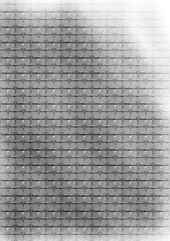

   
# Header :   
   
   
-------------------------------------------------------------------------------   
# Body   
   
## Ambiance   
   
Lieu de haute technologie, c'est un endroit ressemblant au base américaine d'écoute de l'espace ou d'observation météo. , avec toutes sortes d'appareils, assez désert, dans des collines et bien cachée et éloignée de la vue de tous.   
   
Il y a des réseaux de grottes souterrains où la resonance est insoutenable et où le bruit doit être minimisé au maximum sous peine de faire déclencher une alerte générale. Le soucis, c'est que ces grottes sous hautes surveillance sont le seul accès !   
   
## Histoire   
   
Un peu comme le [Nez](../../../../../Cr%C3%A9ations/Symbiose/GameDesign/Sc%C3%A9nario/Lieux/Nez.md), c'est un endroit de communication avec l'extérieur, mais très sécurisé et bien caché, presque personne ne sait y aller, c'est un endroit qui renferme des secrets et des technologies que seuls les érudits maîtrisent. Parfois on y retrouve quelques déchets posés par inadvertance lorsque certaines particules se perdent en chemin, mais l'endroit est très méconnu de tous, et parfois des gens se retrouvent là sans comprendre où ils sont, et font simplement demi tour en comprenant qu'ils sont à l'extérieur ou presque !   
   
## Population   
   
On y croise quelques [Follicule](../../../../../Cr%C3%A9ations/Symbiose/GameDesign/Sc%C3%A9nario/Personnages/Follicule.md) mais très peu c'est surtout un endroit de recherche.   
   
## Graphisme   
### Premier jet   
   
   
   
---------------------------------------------------------------------------   
# Footer   
   
##### Tags   
`{_obsidian_pattern_tag_symbiose}` `{_obsidian_pattern_tag_lieu}`   
   
*créé le 2023-07-31 à 15:44*