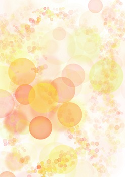

   
# Header :   
   
   
-------------------------------------------------------------------------------   
# Body   
   
## Ambiance   
   
Zone très rouge, épaisse, avec des sortes de grosses boules qui se gonflent lentement en émettant de la lumière et puis se dégonflent d'un coup en s'éteignant en produisant un bruit de piston un *pffff*.     
   
## Histoire   
   
Les poumons sont un lieu rempli principalement de [Globule](../../../../../Cr%C3%A9ations/Symbiose/GameDesign/Sc%C3%A9nario/Personnages/Globule.md), dénué d'esprit guerrier et non fait pour le combat, malheureusement, directement connecté au [Nez](../../../../../Cr%C3%A9ations/Symbiose/GameDesign/Sc%C3%A9nario/Lieux/Nez.md) et à la [Bouche](/not_created.md), cet endroit est le lieu d'arrivée d'éventuels intrus, une fois arrivés dans cette zone, le carnage n'a malheureusement pas trop le choix que de commencer    
   
## Population   
   
C'est les [Globule](../../../../../Cr%C3%A9ations/Symbiose/GameDesign/Sc%C3%A9nario/Personnages/Globule.md) qui se bousculent à la porte des poumons globalement, même si d'autres population sont aussi dans le coin(*comme les [alvéoles](/not_created.md) si on les incorpores au jeu*). Il y a surtout souvent des intrusions et donc les unités de [Lymphocyte](../../../../../Cr%C3%A9ations/Symbiose/GameDesign/Sc%C3%A9nario/Personnages/Lymphocyte.md) et/ou d'[Anticorps](../../../../../Cr%C3%A9ations/Symbiose/GameDesign/Sc%C3%A9nario/Personnages/Anticorps.md) y accourent.    
   
## Graphisme   
   
   
   
   
---------------------------------------------------------------------------   
# Footer   
   
##### Tags   
`{_obsidian_pattern_tag_symbiose}` `{_obsidian_pattern_tag_lieu}`   
   
*créé le 2023-07-31 à 15:44*