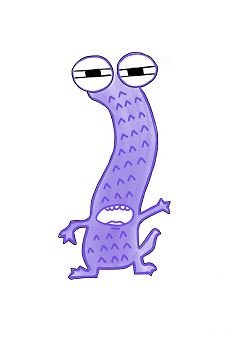

   
# Header :   
   
   
-------------------------------------------------------------------------------   
# Body   
   
## Psychologie   
   
Le conseiller est un personnage hésitant et soumis à notre autorité. Il n'est pas idiot, il est parfois de bon conseil, mais il a un peu une voix tremblotante, comme si il n'était jamais sur de lui. C'est un peu notre souffre douleur en tant que [Chef](../../../../../Cr%C3%A9ations/Symbiose/GameDesign/Sc%C3%A9nario/Personnages/Chef.md), on a tendance à passer ses nerfs sur lui. Attention qu'il est quand même fort apprécié par la [La population de notre colonie](/not_created.md), donc trop le rabaisser ne plaît pas trop. Dans l'idée, il ressemble un peu au personnage de Reivax dans le Donjon de Naheulbeuk, totalement soumis à son maître, obéissant, mais souvent de bon conseil.    
## Description physique   
   
C'est un personnage... Mou, un peu une loque, on peut le voir comme une larve ou une limace qui traîne son corps en rampant d'un endroit à l'autre en laissant pourquoi pas une trainée de bave derrière lui. Lorsqu'on lui parle, il a du mal à rester stable, et son corps flasque s'effondre sur la gauche ou sur la droite, il doit le remettre en place avec son corps, ce qui est un peu déroutant et dégueulasse. Il a des lunettes, et je le vois bien avoir un défaut de prononciation, style zozotement, ou bégaiement, quelque chose qui traduit son insécurité.   
   
## Histoire   
   
On ne sait pas trop d'où il est devenu si proche de notre personnage, c'est une vieille histoire, en tout cas il fait partie des meubles et vous un dévouement sans faille à notre personne, même si on est parfois un peu méchant avec lui, d'ailleurs on l'aime profondément aussi.    
## Graphisme   
### Premier jet   
   
   
   
   
---------------------------------------------------------------------------   
# Footer   
   
##### Tags   
`{_obsidian_pattern_tag_symbiose}` `{_obsidian_pattern_tag_personnage}`    
   
*créé le 2023-07-31 à 15:44*