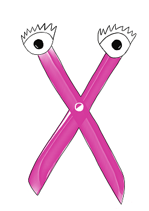

   
# Header :   
   
   
-------------------------------------------------------------------------------   
# Body   
   
## Psychologie   
   
Les Enzymes sont des travailleurs fidèles et efficaces. Un peu bourru parfois, mais toujours à l'heure pour se donner à fond pour la communauté. Ils sont un maillons vital de la chaîne, et utilisent parfois ce moyen de pression pour avoir ce qu'ils veulent, comme des meilleures conditions de travail. Globalement, psychologiquement, ils ne sont pas spécialement étrange ou spécifique, il y a une population énorme d'Enzyme, chacun avec sa vie et sa manière de la voir. C'est à dire que chaque individu peu avoir ses envies et ses problèmes à un moment qui ne sont pas ceux du voisin, ce qui laisse une énorme flexibilité de possibilité et de comportement, par contre lorsqu'on les prends sous forme de groupe, en masse, et lorsqu'ils réussissent à élire un représentant pour faire une actions de groupe, c'est souvent qu'il y a un soucis structurel et qu'ils veulent travailler moins, avoir plus à manger ou plus de droits. Et lorsque c'est le cas, ne pas négocier avec eux peut avoir des répercussions sur l'ensemble de la communauté, car ils sont à la base de la chaîne d'approvisionnement, ils forment la base de la pyramide de la communauté. Ils ne manque pas de courage et peuvent donc aider à la défense et à la bataille en cas de coup dur, par contre, ils manquent en général un peu d'éducation ce qui peut créer des soucis car ils ne maîtrisent pas tout et peuvent être maladroit.   
   
## Description physique   
   
Lorsqu'on les voit, on comprend qu'ils sont une structure solide et efficace, comme une pince ou un ciseau. Le plus clair de leur temps est passé à découper des choses et en réparer d'autres à l'aide de leurs appendices. Ils sont souvent coiffé d'un casque car ils travaillent dans des endroits dangereux. Certains sont plus petits et trapus que d'autres pour optimiser leur force, tandis qu'au contraire, certains autres spécialisé dans le travail de précision sont plus fin et longiligne.   
   
## Histoire   
C'est la masse ouvrière de [Symbiose](../../../../../index.md), un peu comme les mineurs ou les ouvriers du bâtiments. ils agissent principalement dans le système [Digestif](../../../../../Cr%C3%A9ations/Symbiose/GameDesign/Sc%C3%A9nario/Lieux/Digestif.md). Lorsqu'un problème de plus grande envergure apparaît quelque part ailleurs, on va souvent leur demander un coup de main, pour une bataille ou pour un coup de main physique. Ils ont toujours bien suivi les ordres et il faut le faire pour les vexer, mais attention à leur pouvoir. Seul ils ne sont rien, mais ensemble, ils peuvent mettre toute la [La population de notre colonie](/not_created.md) en péril.   
## Graphisme   
### Premier jet   
   
   
   
---------------------------------------------------------------------------   
# Footer   
   
##### Tags   
`{_obsidian_pattern_tag_symbiose}` `{_obsidian_pattern_tag_personnage}`    
   
*créé le 2023-07-31 à 15:44*