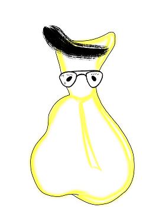

   
# Header :   
   
   
-------------------------------------------------------------------------------   
# Body   
   
## Psychologie   
   
Le follicule est une princesse. C'est un bon résumé. C'est le Schtroumpf coquet de la colonie. Tendance au comportement *précieux*, faut pas trop les déranger globalement. Ils ont beaucoup de demande, et ne sont pas spécialement utile à la communauté. Par contre ils sont indispensable à l'[hôte](/not_created.md) pour sa santé, et comme c'est la que la communauté habite, ils savent au combien on ne peut rien leur dire. C'est un peu l'opposé des [Enzyme](../../../../../Cr%C3%A9ations/Symbiose/GameDesign/Sc%C3%A9nario/Personnages/Enzyme.md), toujours prêt à rendre service car indispensable, les Follicules, eux, au contraire, savent qu'ils sont indispensable et s'en servent pour en faire le moins possible et s'occuper d'eux-mêmes. Le truc, c'est que ça les rends particulièrement attractif physiquement aux gens de [La population de notre colonie](/not_created.md), et notamment aux nôtres en tant que [Chef](../../../../../Cr%C3%A9ations/Symbiose/GameDesign/Sc%C3%A9nario/Personnages/Chef.md). Ils sont autant apprécié pour leurs physiques que détesté pour leur comportement exécrable. Si on ne va pas leur parler, ce ne sont pas eux qui vont venir à nous, sauf pour se plaindre, mais si ils ont daigné se déplacer, c'est que ça ne sent pas bon !    
## Description physique   
   
Le monde de l'infiniment petit n'est pas le nôtre, et les caractéristiques physiques de ce qui fait un être quelque chose d'attractif ne regarde que le monde de [Symbiose](../../../../../index.md) ! En tout cas, les follicules, sont coiffé d'un unique cheveux qu'ils passent à entretenir toute la journée. Plus ce cheveux est brillant, plus ils sont considéré joli. Il a des formes très courbes, très ronde. il est bien en chair, et a une unique dent polie comme jamais et qui reflète chaque lumière qui la touche comme un diamant.    
## Histoire   
   
Les follicules sont étendus sur l'entièreté de la [Peau](../../../../../Cr%C3%A9ations/Symbiose/GameDesign/Sc%C3%A9nario/Lieux/Peau.md), ce qui fait qu'ils sont présents un peu partout dans le corps à l'extérieur. Ce sont d'ailleurs un des rares corpuscule de [La population de notre colonie](/not_created.md) qui survit en extérieur, ce qui les rends extrêmement utile à la défense **avant** que ça soit critique. Ils capturent les ennemis à l'aide de leur unique cheveu et mordent ensuite la victime avec leur unique dent, mais à vrai dire, ils préfèrent ne pas se battre et profiter du vent dans leur cheveux et du soleil pour bronzer. Ils sont aussi présent dans des endroits assez reclus, comme les [Oreilles](../../../../../Cr%C3%A9ations/Symbiose/GameDesign/Sc%C3%A9nario/Lieux/Oreilles.md) et proche des [Yeux](../../../../../Cr%C3%A9ations/Symbiose/GameDesign/Sc%C3%A9nario/Lieux/Yeux.md), des endroits peuplé par très peu d'autres population, voir aucune. Un jour, nous jetterons notre dévolu sur un follicule, ce qui créera le scénario secondaire de l'[Histoire d'amour avec un Follicule](../../../../../Cr%C3%A9ations/Symbiose/GameDesign/Sc%C3%A9nario/Histoire/Secondaires/Histoire%20d%27amour%20avec%20un%20Follicule.md).   
   
## Graphisme   
### Premier jet   
   
   
   
---------------------------------------------------------------------------   
# Footer   
   
##### Tags   
`{_obsidian_pattern_tag_symbiose}` `{_obsidian_pattern_tag_personnage}`    
   
*créé le 2023-07-31 à 15:44*