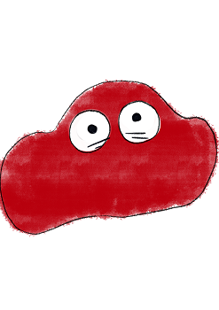
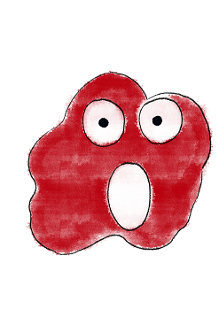

   
# Header :   
   
   
-------------------------------------------------------------------------------   
# Body   
   
## Psychologie   
   
Globule, c'est **le** pote qu'on veut avoir quand on a 10 ans ! C'est un enfant dans sa tête, il est tout fou, super actif, toujours à vouloir faire des choses, aider, courir, jouer, ... Malheureusement, quand on doit gérer une colonie, ça n'as pas que des avantages ! Il est difficile de vexer réellement un globule, ce qui fait que les choix avec eux ont souvent peu d'impacte sur la [La population de notre colonie](/not_created.md), par contres tout les mondes les apprécies, donc attention quand même à ne pas se mettre tous les autres membres de la communauté à dos. Ils sont plutôt maladroit car trop speed, et ont du mal à suivre des instructions sur la longueur. Ce sont vraiment des enfants, mais pour le côté qu'on aime des enfants, ils ne sont jamais réellement triste ou en colère !   
   
## Description physique   
   
Alors là, il n'y a pas de secrets, globule, il est rond, il est rouge, et il souris ! Et il a des grands yeux pleins de vie, on lit tout de suite ses sentiments dans ses yeux, et il est trop mignon quand il est vexé.   
## Histoire   
   
Les globules sont des transporteurs, ils se baladent littéralement **partout** et rapidement. parfois ils oublient leur cargaisons, parfois ils la renversent sur le chemin. Il y a aussi une **énorme** population de globule, comme les [Enzyme](../../../../../Cr%C3%A9ations/Symbiose/GameDesign/Sc%C3%A9nario/Personnages/Enzyme.md) quelque part, mais les enzymes travaillent dans des endroits sombres et ne sont pas aussi visible que les globules, qui eux font du bruit, sont visible et courent dans tous les sens.    
   
## Graphisme   
### Premier jet   
   
   
   
   
---------------------------------------------------------------------------   
# Footer   
   
##### Tags   
`{_obsidian_pattern_tag_symbiose}` `{_obsidian_pattern_tag_personnage}`    
   
*créé le 2023-07-31 à 15:44*