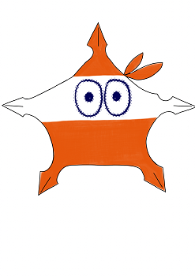

   
# Header :   
   
   
-------------------------------------------------------------------------------   
# Body   
   
## Psychologie   
   
Les Lymphocytes sont un peu comme des enfants qui jouent à la police. Ils sont serviable et protecteur, mais en font des caisses, sautent partout, une sorte de croisement entre un [Globule](../../../../../Cr%C3%A9ations/Symbiose/GameDesign/Sc%C3%A9nario/Personnages/Globule.md) et un [Anticorps](../../../../../Cr%C3%A9ations/Symbiose/GameDesign/Sc%C3%A9nario/Personnages/Anticorps.md), ils ont une manière un peu... Maladroite d'assurer la défense de la colonie. Ca n'en fait pas des mauvais éléments pour autant, et ils sont très utile, juste que ils vont en faire trop, tout le temps, et le moindre petit incident peut leur donner envie de déployer des moyens phénoménaux sur un coup de tête. Ils veulent parfois se camoufler, pour faire des attaques surprises, tels des ninjas, pour eux ça les amuses, mais c'est en fait un boulot super important. Ils sont rigolos, mais un peu oppressant comme des enfants un peu trop... Présents. Il attaquent en groupe avec des plans alambiqués un peu folklorique, mais lorsqu'ils gagnent la bataille, ça se transforme un peu en chacun pour sois pour savoir qui va tirer les honneurs. Ils sont à la recherche d'une tape dans le dos pour leur dire qu'ils ont bien fait.   
## Description physique   
   
Ils sont en tenue de ninja, camouflé, et aussi large que haut, avec des courbes et des pointes, ce qui leur donne une apparence gentille, ou fun, mais en même temps un peu dangereuse, comme un bébé qui tiendrai un couteau.   
   
## Histoire   
   
Les lymphocytes se baladent dans tous le corps, naissent dans les [Os](../../../../../Cr%C3%A9ations/Symbiose/GameDesign/Sc%C3%A9nario/Lieux/Os.md), où ils reçoivent une spécialité, mais ensuite ils sont envoyés partout pour aider à la défense. Ils se baladent souvent en groupe, se montent les uns sur les autres. lors de leurs déplacements. Comme ils sont assez gros, pressés, et organisé-désorganisés, ils créent souvent des embouteillages à des endroits clé.   
   
## Graphisme   
### Premier jet   
   
   
   
---------------------------------------------------------------------------   
# Footer   
   
##### Tags   
`{_obsidian_pattern_tag_symbiose}` `{_obsidian_pattern_tag_personnage}`    
   
*créé le 2023-07-31 à 15:44*